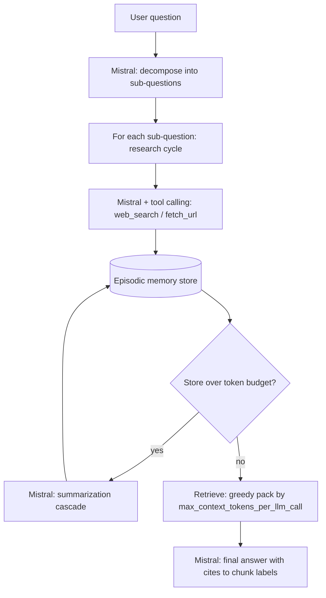

# G3 - Deep Research Agent under Memory Constraints

This repository implements a **multi-step research agent** that (1) **decomposes** complex questions, (2) **collects evidence** via web search + optional page fetch, (3) **stores** observations in a bounded memory, (4) **compacts** memory when it grows too large, and (5) **answers** using **budgeted retrieval** so injected evidence stays under a declared cap.

## Exact stack (matches the G3 brief)

| Brief item | What we ship |
| --- | --- |
| **LLM + tool use** | **Mistral** via `mistralai`, using **tool calling** for `web_search` and `fetch_url` during each sub-question (`research_agent/mistral_tooling.py`). |
| **Memory** | **Episodic buffer** + **summarization cascade** + **budgeted retrieval (BM25 ranking)** (`research_agent/memory.py`). |
| **Constraints** | Self-defined caps in `research_agent/config.py` (context injection budget, session memory budget, optional USD ceiling). |
| **Workflow** | **n8n** imports `orchestration/n8n_g3_research.json` -> **Webhook** -> **HTTP Request** to **FastAPI** `POST /research` (`research_agent/api.py`). Dify can call the same HTTP endpoint as an external tool. |

If `MISTRAL_API_KEY` is set, `LLM_PROVIDER` defaults to **`mistral`** (see `research_agent/llm.py`). Other providers still work for local experimentation but are not the "canonical" stack.

## Why this exists (business framing)

Client value is less "more text" and more **governed research**: predictable cost, bounded context, and traceability (what evidence made it into the answer). This prototype optimizes for that by making budgets and retrieval explicit.

Two concrete scenarios this design targets:

- **Market / competitor research:** a user asks for a comparison across several vendors, and the agent must gather evidence without pasting an unbounded pile of snippets into the final prompt.
- **Policy / technical brief prep:** a user needs a short answer with supporting evidence, but the workflow must stay within a fixed token or spend budget per session.

## Architecture



## Constraints (self-defined)

Defaults live in `research_agent/config.py` and are documented in `evaluation.md`.

- **`max_context_tokens_per_llm_call`:** hard cap on retrieved memory injected into final synthesis (token *estimates*).
- **`max_session_memory_tokens`:** triggers **summarization cascade** when the raw store grows too large.
- **Optional `max_cost_usd_per_session`:** stop early when estimated spend crosses a ceiling (requires price env vars).

## Setup

```powershell
cd assignment_2
python -m venv .venv
.\.venv\Scripts\Activate.ps1
pip install -r requirements.txt
copy .env.example .env
```

Edit `.env` and set **`MISTRAL_API_KEY`** (recommended). Optional: `LLM_PROVIDER=mistral` and `LLM_MODEL` (defaults to `mistral-small-latest` if unset).

## Run

**Canned live demo (uses your configured LLM + search tools):**

```powershell
python -m research_agent demo --pretty
```

**Your own question:**

```powershell
python -m research_agent run "Question part A ... Question part B ..." --pretty
```

**Offline / deterministic demo (no API key required):**

```powershell
python -m research_agent demo --mock-tools --pretty
```

This offline mode is designed for reviewer reproducibility: it still exercises decomposition, memory writes, retrieval selection, and final answer synthesis, but uses deterministic mock evidence instead of live APIs.

You can also set `RESEARCH_USE_MOCK_TOOLS=1` in `.env`, or pass `--mock-tools` on the CLI (preferred; avoids global env side effects).

## n8n workflow + API

1. Start the HTTP service (same Python venv):

```powershell
uvicorn research_agent.api:app --host 0.0.0.0 --port 8000
```

2. In n8n: **Import from File** -> `orchestration/n8n_g3_research.json`.
3. Point the **HTTP Request** node at where the API runs:
   - n8n on Docker Desktop (common): `http://host.docker.internal:8000/research`
   - everything n8n+API on host: `http://127.0.0.1:8000/research`
4. Call the webhook with JSON like: `{"question":"...","mock_tools":false}`. If your Webhook node exposes a flat payload, edit the HTTP node JSON to use `$json.question` instead of `$json.body.question`.

**Dify (alternative):** add an **HTTP Request** / tool that `POST`s the same JSON body to `/research`.

## Self-assessment (rubric alignment)

- **Technical execution:** The end-to-end path works offline with `--mock-tools`; live mode depends on network + provider availability. Errors in search/fetch return empty/partial evidence rather than crashing the loop.
- **Documentation / reproducibility:** `README.md`, `evaluation.md`, `.env.example`, and structured JSON output (including selected chunk IDs) are meant to make review straightforward.
- **Creativity / constraints:** The design intentionally avoids "dump everything into context" and documents trade-offs in `evaluation.md`.
- **Business impact:** The output includes retrieval metadata and session estimates so a reviewer can connect behavior to cost/latency governance.

## Reviewer Notes

- The fastest no-credential check is `python -m research_agent demo --mock-tools --pretty`.
- The intended stack for the assignment is still the live **Mistral + tools + n8n/FastAPI** path; the mock mode exists to make the prototype easy to review even when live search or model access is unavailable.

## Files

- `research_agent/agent.py` - orchestration loop + session ledger
- `research_agent/mistral_tooling.py` - Mistral tool calling (`web_search`, `fetch_url`)
- `research_agent/memory.py` - episodic store, compaction, budgeted selection
- `research_agent/tools.py` - search + fetch + mock mode
- `research_agent/llm.py` - provider wrapper + JSON parsing
- `research_agent/api.py` - FastAPI entrypoint for n8n/Dify
- `orchestration/n8n_g3_research.json` - importable n8n workflow
- `evaluation.md` - architecture trade-offs (required by G3)
